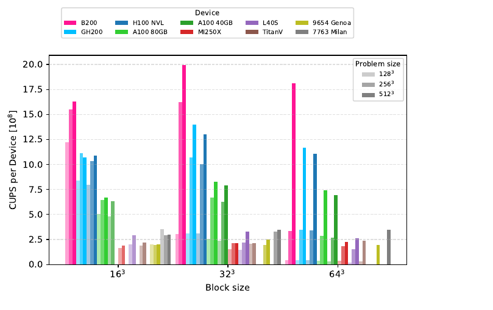
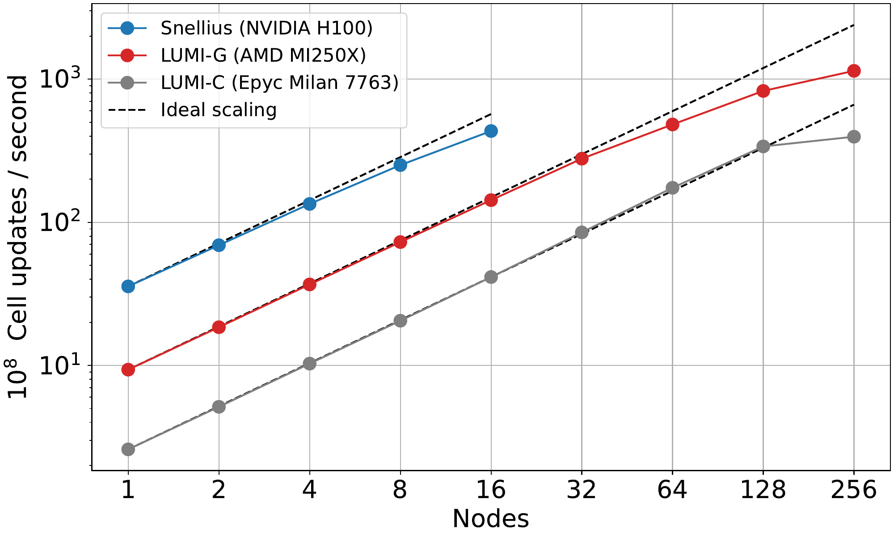
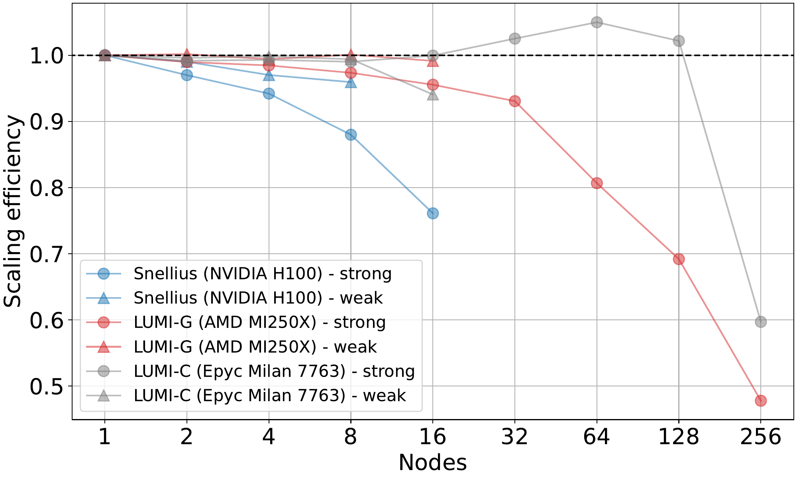

[](https://github.com/amrvac/AGILE/actions/workflows/tests.yml)
[](https://github.com/amrvac/AGILE/actions/workflows/gpu.yml)

# AGILE

This is the public development repository of AGILE, a GPU enabled fork of MPI-AMRVAC. 
See the publication <https://arxiv.org/abs/2607.19277> for details.  
The documentation is available under <https://amrvac.github.io/AGILE/>.  

## Installation
To install, follow these steps:
- install the uv package manager `pip install uv` or `curl -LsSf https://astral.sh/uv/install.sh | sh`
- make sure `$AGILE_DIR` points to the repository root folder
- install the required python packages: `cd $AGILE_DIR` and run `uv sync` and activate them `source $AGILE_DIR/.venv/bin/activate`
- go into a test, e.g. `cd $AGILE_DIR/tests/hd/KH3D`
- to compile, load the appropriate modules, e.g. on snellius:
```
module purge
module load 2023
module load OpenMPI/4.1.5-NVHPC-24.5-CUDA-12.1.1
```
- compile with nvfortran and the OpenACC GPU backend via `make arch=nvidia OPENACC=1`,
  or the OpenMP target-offload backend via `make arch=nvidia OPENMP=1`
  (`OPENACC` and `OPENMP` are mutually exclusive)


## Currently supported features on master
- Cartesian grids
- Physics modules: hd, mhd [glm], ffhd, srhd
- Source terms (gravity, radiative cooling, hyperbolic thermal conduction, user defined) and boundary conditions (`symm, asymm, cont` etc. but also `special`)
- Multi-GPU (MPI)
- Uniform grid, static mesh refinement (SMR) and adaptive mesh refinement (AMR)

## Performance
Detailed performance benchmarks are presented in the [AGILE paper](https://arxiv.org/abs/2607.19277) (Porth et al., "Astrophysics on GPUs: introducing AGILE 1.0").
Single-device benchmarks use a uniform-grid, double-Kelvin-Helmholtz hydrodynamics test (linear reconstruction, Lax-Friedrichs fluxes, three-step Runge-Kutta), measured in cell updates per second (CUPS), where one "update" is one Runge-Kutta substep.

| Device | Performance [10<sup>8</sup> CUPS] |
| --- | --- |
| B200 "Mindwell" | 19.91 |
| GH200 "ETP" | 13.98 |
| H100 SXM5 96GB "Snellius" | 13.01 |
| A100 SXM4 80GB "wICE" | 8.28 |
| A100 SXM4 40GB "Snellius" | 7.89 |
| MI250X 1 GCD "LUMI" | 2.16 |
| L40S | 2.11 |
| TitanV | 2.11 |
| Dual EPYC 9654 Genoa "Snellius" | 2.51 |
| Dual EPYC 7763 Milan "LUMI" | 3.41 |

*Single GPU / full CPU node performance for a uniform-grid 3D hydrodynamics run with a block size of 32<sup>3</sup> and a domain size of 256<sup>3</sup> or 512<sup>3</sup> cells (whichever fits in device memory).*

Performance correlates strongly with memory bandwidth: the most recent cards (B200, GH200, H100) perform best, while on the CPU side AGILE also scales well across many cores, with a dual EPYC 7763 Milan node (128 cores) outperforming a dual EPYC 9654 Genoa node (192 cores). A parameter scan over block and problem sizes (see the paper for details) shows that even small blocks of 16<sup>3</sup> cells already give good, and sometimes superior, performance compared to larger blocks, which makes AGILE's update algorithm well suited to AMR runs with moderate block sizes and efficient local refinement; saturation is typically reached once at least 512 blocks are resident per device.



Multi-GPU strong- and weak-scaling tests use the same double-Kelvin-Helmholtz setup with a fixed block size of 16<sup>3</sup>, on Snellius (4x NVIDIA H100 per node) and LUMI-G (4x AMD MI250X per node), alongside the LUMI CPU partition for reference. AGILE scales well on both NVIDIA and AMD GPUs as well as on CPUs: LUMI-G retains 70% strong-scaling efficiency out to 64 nodes (2048 MI250X GCDs, reaching 10<sup>11</sup> CUPS), while Snellius reaches around 75% efficiency at 16 nodes, the largest scale tested there.





On the Dutch national supercomputer Snellius, one Genoa CPU node costs the same in "system billing units" as a single H100 GPU; given the performance difference this yields a >5x reduction in cost-to-solution when using H100s instead of the fastest CPU partition (a 4.7x reduction for A100s). 
